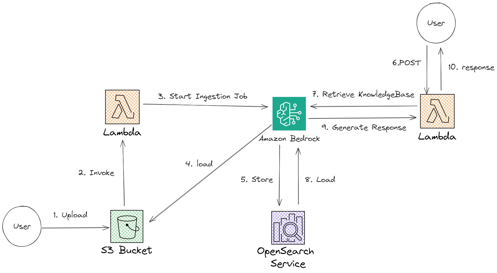
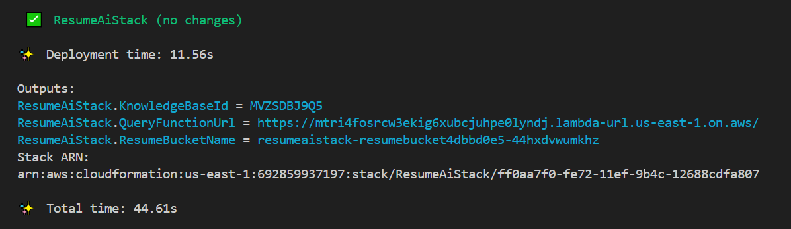

# Blog Description
[Easy Serverless RAG with Knowledge Base for Amazon Bedrock](https://community.aws/content/2bi5tqITxIperTzMsD3ohYbPIA4/easy-rag-with-amazon-bedrock-knowledge-base?lang=en)



# Prerequisites

## Install and Configure AWS CLI
1. Install AWS CLI by following the official guide: [AWS CLI Installation](https://docs.aws.amazon.com/cli/latest/userguide/install-cliv2.html)
2. Configure AWS CLI by running the following command and following the prompts:
   ```sh
   aws configure
   ```

## Install Node.js
1. Download and install Node.js from the official website: [Node.js Download](https://nodejs.org/)
2. Verify installation:
   ```sh
   node -v
   ```

## Install AWS CDK
1. Install AWS CDK globally using npm:
   ```sh
   npm install -g aws-cdk
   ```
2. Verify installation:
   ```sh
   cdk --version
   ```

## Install Docker
1. Download and install Docker from the official website: [Docker Download](https://www.docker.com/get-started)
2. Verify installation:
   ```sh
   docker --version
   
## Step 1: Set Execution Policy
1. Open the command prompt and run the following command:
   ```sh
   set-ExecutionPolicy RemoteSigned -Scope CurrentUser
   ```
2. This command sets all policies for the current user as remotely signed. It will take a few seconds to complete.

## Step 2: Verify Execution Policy
1. Run the following command to check the execution policy:
   ```sh
   Get-ExecutionPolicy
   ```
2. If the output shows `RemoteSigned`, the policy has been set successfully.

## Step 3: View Execution Policy List
1. To view the list of policies updated by the previous commands, run:
   ```sh
   Get-ExecutionPolicy -list

# Preparing Project

We will start creating our project folder by running the following command in our terminal:

```sh
mkdir resume-ai && cd resume-ai
```

Then initialize our CDK project:

```sh
cdk init app --language javascript
```

## Prepare Resume Data

First, prepare our resume data in a text or PDF file and save it as `data/resume.txt` with example content like this:

```
Personal Information:
Name: Jeet Prajapati
......
Objective:
Education:
Certifications:
Work Experience:
Skills:
Hobbies:
References:
```

## Prepare Lambda Function Code

Create the `src` folder:

```sh
mkdir src
```

Create our first lambda function in `src/queryKnowledgeBase`:

```sh
mkdir src/queryKnowledgeBase && touch src/queryKnowledgeBase/index.js
```

Inside `src/queryKnowledgeBase/index.js`, add the following code:

```javascript
const {
  BedrockAgentRuntimeClient,
  RetrieveAndGenerateCommand,
} = require("@aws-sdk/client-bedrock-agent-runtime");

const client = new BedrockAgentRuntimeClient({
  region: process.env.AWS_REGION,
});

exports.handler = async (event, context) => {
  const { question } = JSON.parse(event.body);

  const input = {
    input: { text: question },
    retrieveAndGenerateConfiguration: {
      type: "KNOWLEDGE_BASE",
      knowledgeBaseConfiguration: {
        knowledgeBaseId: process.env.KNOWLEDGE_BASE_ID,
        modelArn: `arn:aws:bedrock:${process.env.AWS_REGION}::foundation-model/anthropic.claude-v2`,
      },
    },
  };

  const command = new RetrieveAndGenerateCommand(input);
  const response = await client.send(command);

  return JSON.stringify({ response: response.output.text });
};
```

Create our second lambda function in `src/IngestJob`:

```sh
mkdir src/IngestJob && touch src/IngestJob/index.js
```

Inside `src/IngestJob/index.js`, add the following code:

```javascript
const {
  BedrockAgentClient,
  StartIngestionJobCommand,
} = require("@aws-sdk/client-bedrock-agent");

const client = new BedrockAgentClient({ region: process.env.AWS_REGION });

exports.handler = async (event, context) => {
  const input = {
    knowledgeBaseId: process.env.KNOWLEDGE_BASE_ID,
    dataSourceId: process.env.DATA_SOURCE_ID,
    clientToken: context.awsRequestId,
  };
  const command = new StartIngestionJobCommand(input);

  const response = await client.send(command);
  console.log(response);

  return JSON.stringify({ ingestionJob: response.ingestionJob });
};
```

## Build Our Services with CDK Constructs

Edit `lib/resume-ai-stack.js` and add the following code:

```javascript
const { Stack, Duration, CfnOutput, RemovalPolicy } = require("aws-cdk-lib");
const s3 = require("aws-cdk-lib/aws-s3");
const lambda = require("aws-cdk-lib/aws-lambda");
const { bedrock } = require("@cdklabs/generative-ai-cdk-constructs");
const { S3EventSource } = require("aws-cdk-lib/aws-lambda-event-sources");
const iam = require("aws-cdk-lib/aws-iam");

class ResumeAiStack extends Stack {
  constructor(scope, id, props) {
    super(scope, id, props);

    const resumeBucket = new s3.Bucket(this, "resumeBucket", {
      removalPolicy: RemovalPolicy.DESTROY,
      autoDeleteObjects: true,
    });

    const resumeKnowledgeBase = new bedrock.VectorKnowledgeBase(this, "resumeKnowledgeBase", {
      embeddingsModel: bedrock.BedrockFoundationModel.TITAN_EMBED_TEXT_V1,
    });

    const lambdaQuery = new lambda.Function(this, "Query", {
      runtime: lambda.Runtime.NODEJS_20_X,
      handler: "index.handler",
      code: lambda.Code.fromAsset("./src/queryKnowledgeBase"),
      timeout: Duration.minutes(5),
      environment: {
        KNOWLEDGE_BASE_ID: resumeKnowledgeBase.knowledgeBaseId,
      },
    });

    new CfnOutput(this, "QueryFunctionUrl", { value: lambdaQuery.addFunctionUrl().url });
  }
}

module.exports = { ResumeAiStack };
```

## Deploy

Run the following command to deploy:

```sh
cdk deploy
```
After deployment is complete, CDK will return several output values including KnowledgeBaseId, QueryFunctionUrl and ResumeBucketName.



After deployment, sync your data folder to S3:

```sh
aws s3 sync data s3://<s3_bucket-name>
```

# Setting Up a Node.js Project with Front-end and Back-end

## 1. Add `front-end.html` and `back-end.js` Files
Create two files in your project directory:

- `front-end.html` (for the UI)
- `back-end.js` (for the server)

## 2. Install Dependencies
Run the following command to install necessary dependencies:

```sh
npm i express cors body-parser node-fetch@2
```

## 3. Run the Back-end Server

```sh
node back-end.js
```
